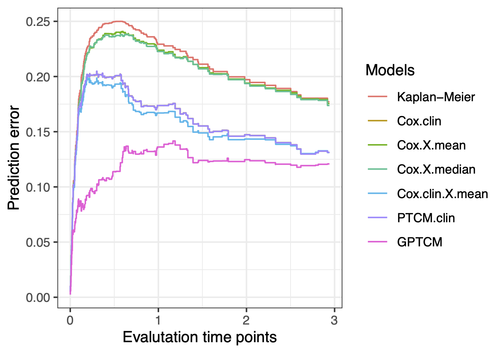

# GPTCM
<!-- 
[](https://cran.r-project.org/package=GPTCM)
[](https://doi.org/10.32614/CRAN.package.GPTCM)
[](https://ocbe-uio.r-universe.dev/GPTCM)
-->
[](https://github.com/ocbe-uio/GPTCM/actions)
[](https://www.gnu.org/licenses/gpl-3.0)


This is an R package **GPTCM** implementing Bayesian hierarchical modeling for a generalized promotion time cure model (GPTCM) ([Zhao \& Kızılaslan, 2024](https://doi.org/10.48550/arXiv.2408.17188); [Zhao et al., 2025](https://doi.org/10.48550/arXiv.2509.01001)) for the identification of cell-type-specific tumor driver genes and survival prognosis. 

## Installation

Install the latest released version from [CRAN](https://CRAN.R-project.org/package=GPTCM)

```r
install.packages("GPTCM")
```

Install the latest development version from [GitHub](https://github.com/ocbe-uio/GPTCM):

```r
#install.packages("remotes")
remotes::install_github("ocbe-uio/GPTCM")
```

## A simulation study

We provide insights about the parameter estimation of the proposed GPTCM by using Monte Carlo simulations. 
We consider sample sizes of $n=200$. 
Each sample/patient has two clinical covariates (i.e. one row of the clinical data matrix $\mathbf X_0\in \mathbb R^{n\times 2}$), and has cells belonging to $L=3$ tumor cell subtypes with each subtype consisting of $10$ cell-type-specific covariates (i.e. one row of data matrix $\mathbf X_l\in \mathbb R^{n\times 10}$, $l\in \\{1,...,L\\}$). 
Each sample also has tumor cell subtype proportions data (i.e. one row of the proportions data matrix $\mathbf p\in [0,1]^{n\times 10}$) 
generated by $10$ cell-type-specific covariates based on the Dirichlet regression model. 
Every covariate is generated independently from the standard normal distribution except the first clinical variable generated from the Bernoulli distribution. 
The tumor cell subtype proportions of each sample is generated independent from the Dirichlet distribution. 

The survival times are generated based on the population survival function using rate parameter $\theta=\exp(\xi_0+\mathbf X_0\boldsymbol\xi)$, using the Weibull distributed survival functions with 
mean parameters $\boldsymbol\mu_{l}= \exp(\beta_{0l} + \mathbf X_{l} \boldsymbol \beta_l)$, and using the Dirichlet distributed cell type proportions with concentration parameters $\boldsymbol\alpha_{l}= \exp(\zeta_{0l} + \mathbf X_{l} \boldsymbol \zeta_l)$,  $l\in \\{1,...,L\\}$. 
We use latent indicator variables for Bayesian variable selection, i.e. $\boldsymbol \gamma_l = 1\\{\boldsymbol \beta_l\ne 0\\}$ and $\boldsymbol \eta_l = 1\\{\boldsymbol \zeta_l\ne 0\\}$. 
Censoring is generated through an exponential distribution with censoring rate $20\%$. 
The Kaplan–Meier survival curve is as follows. 
See more details in [Zhao et al. (2025)](https://doi.org/10.48550/arXiv.2509.01001). 

```{r}
rm(list=ls())

# simulate data
set.seed(123)
n <- 200 # subjects
p <- 10 # variable selection predictors
L <- 3 # cell types
library(GPTCM)
set.seed(123)
dat <- simData(n, p, L)

# KM curve
library(survival)
library(survminer)
fit.km <- survival::survfit(Surv(time, event) ~ 1, data = dat$survObj)
ggsurv <- survminer::ggsurvplot(fit.km,
                                conf.int = TRUE, 
                                xlab = "Follow-up time (year)",
                                ylab = "Survival probability (%)",
                                legend = "none",
                                risk.table = TRUE,
                                cumevents = TRUE,
                                palette = "jco",
                                risk.table.title = "Number of patients at risk",
                                tables.height = 0.1,
                                tables.theme = theme_cleantable(), 
                                tables.y.text = FALSE, 
                                ggtheme = theme_light() 
)
ggsurv$plot <- ggsurv$plot + 
  theme(axis.text=element_text(size=15), 
        axis.title=element_text(size=15,face="bold"))
ggsurv
```


<!-- 
We fit one of the proposed GPTCM, GPTCM with the Bernoulli-beta prior (GPTCM-Ber2):

$$
\begin{aligned}
&&\lhd\ Population\ survival\ function \\ 
    S_{pop}(t) &= e^{ -\theta\\{1 - \sum_{l=1}^L \mathtt p_l S_l(t)\\} } \\
    S_l(t) &= e^{-\left(t/\lambda_l\right)^\kappa} \\ 
    \lambda_l &= \frac{\boldsymbol\mu_l}{\Gamma(1+1/\kappa)}\\
&&\lhd\ Cure\ fraction \\ 
    \log\theta &= \xi_0 + \mathbf X_0\boldsymbol\xi \\
&&\lhd\ Noncure\ fraction \\ 
    \log\boldsymbol\mu_l &= \beta_{0l} + \mathbf X_l\boldsymbol\beta_l \\
\text{Spike-and-slab prior:}&& \\
  \beta_{jl} | \gamma_{jl}, \tau_l^2 &\sim \gamma_{jl}\mathcal N(0, \tau_l^2) + (1-\gamma_{jl})\delta_0(\beta_{jl})\\
\text{Bernoulli-beta:}&& \\
  \gamma_{jl}|\pi_{jl} &\sim \mathcal Bernoulli (\pi_{jl}) \\
  \pi_{jl} &\sim \mathcal Beta(a_\pi, b_\pi)\\
&&\lhd\ Measurement\ error\\ 
  \tilde{\mathbf p} &= \mathbf p + \text{Dirichlet error}\\
  f(\tilde{\mathbf p}|\boldsymbol\alpha) &= \frac{1}{\text{B} (\boldsymbol\alpha)}\prod_{l=1}^L\tilde{\mathtt p}_l^{\alpha_l-1} \\
  \log\alpha_l &= \zeta_{0l} + \mathbf X_l\boldsymbol\zeta_l \\
  \zeta_{0l} | w_0^2 &\sim \mathcal N(0, w_0^2) \\
\text{Spike-and-slab prior:}&& \\
  \zeta_{jl} | \eta_{jl}, w_l^2 &\sim \eta_{jl}\mathcal N(0, w_l^2) + (1-\eta_{jl})\delta_0(\zeta_{jl}) \\
\text{Bernoulli-beta:}&& \\
  \eta_{jl}|\rho_{jl} &\sim \mathcal Bernoulli (\rho_{jl}) \\
  \rho_{jl} &\sim \mathcal Beta(a_\rho, b_\rho)
\end{aligned}
$$
-->

After fitting GPTCM-Ber2, we compare its the survival prediction performance with other approaches (i.e. Kaplan-Meier method without covariates, classic Cox model with two clinical covariates (Cox.clin), Cox model with mean aggregate covariates (Cox.X.mean), Cox model with median aggregate covariates (Cox.X.median), Cox model with clinical and mean aggregate covariates (Cox.clin.X.mean), and frequentist semiparametric promotion time cure model with clinical variables (PTCM.clin)). 
The follow figure shows the prediction performance of time-dependent Brier scores. 
It is clear that our GPTCM has much better survival prognosis than other approaches. 

```{r}
## run Bayesian GPTCM
set.seed(123)
fit <- GPTCM(dat, nIter = 1100, burnin = 100)

# draw time-dependent Brier scores
plotBrier(dat, datMCMC = fit, 
          time.star = 3, 
          xlab = "Evalutation time points",
          ylab = "Prediction error")
```



The following figure shows the posterior distributions of cell-type-specific effects associated with cell-type-specific progression with the black diamonds indicating true effects, and marginal posterior inclusion probabilities (mPIP) of Bayesian variable selection (BVS). 

```{r}
# show cel-type-specific effects
plotCoeff(dat, datMCMC = fit, estimator = "beta", bandwidth = 0.02)
# show BVS
plotCoeff(dat, datMCMC = fit, estimator = "gamma")
```


The following figure shows the posterior distributions of cell-type-specific effects associated with cell-type-specific proportions, and mPIP of Bayesian variable selection. 

```{r}
# show cel-type-specific effects
plotCoeff(dat, datMCMC = fit, estimator = "zeta", bandwidth = 0.01)
# show BVS
plotCoeff(dat, datMCMC = fit, estimator = "eta")
```


## References

Chen MH, Ibrahim JG, Sinha D (1999). A new Bayesian model for survival data with
a surviving fraction. Journal of the American Statistical Association, 94(447):909--919.

Yakovlev AY, Tsodikov AD, Asselain B (1996). Stochastic Models of Tumor Latency and Their
Biostatistical Applications. World Scientific, Singapore.

Zhao Z, Kızılaslan F (2024). A note on promotion time cure models with a new biological consideration. [arXiv:2408.17188](https://doi.org/10.48550/arXiv.2408.17188).


Zhao Z, Kızılaslan F, Wang S, Zucknick M (2025). Generalized promotion time cure model: A new modeling framework to identify cell-type-specific genes and improve survival prognosis. [arXiv:2509.01001](https://doi.org/10.48550/arXiv.2509.01001).
